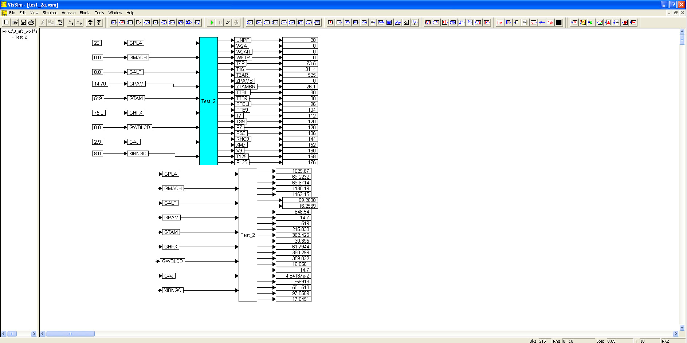

# ========================================
# Utility to Create DLL for Engine Performance Deck Execution in VISSIM:
# ========================================

## Utility to Create DLL for Engine Performance Deck Execution in VISSIM Simulation.

##
## I. Test of DLL for Engine Performance Deck Execution in VISSIM:

##
## II. Utility "C" Interface Source Code: "./src/test_2b.c"

##
## III. DLL for Engine Performance Deck Execution in VISSIM: "./bin/engine_dll.dll":

